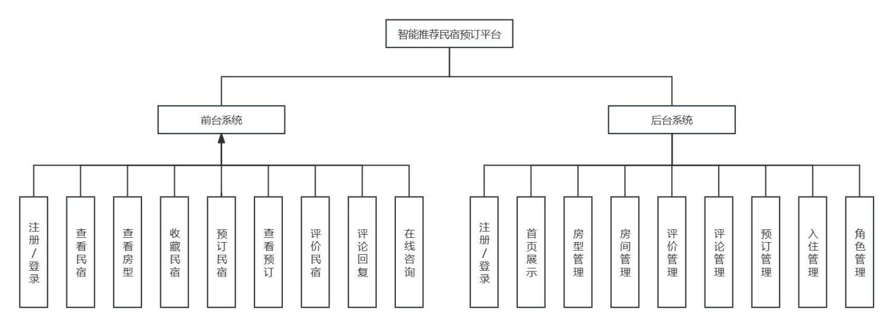
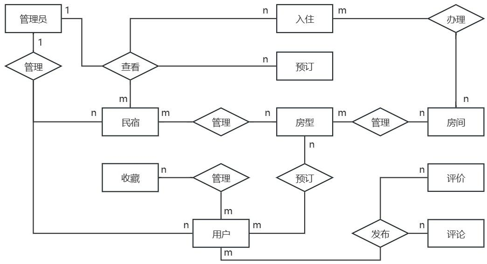

# 智能推荐民宿系统  

## 一.需求分析

### 1.用户  

- 民宿相关信息(民宿位置， 民宿价格, 民宿评价，)
- 民宿订单相关信息(创建订单(增), 取消订单(删), 查看订单(查), 修改订单(改)， 评论(增))

### 2.民宿

- 民宿信息管理(民宿位置， 民宿价格, 民宿评价，)
- 用户订单相关信息(创建订单(增), 取消订单(删), 查看订单(查), 修改订单(改))

### 3.管理员

- 民宿，用户信息管理
- 违规信息处理

## 二.功能架构

### 前后台功能详述

#### 前台(用户交互)

- 增(预定民宿，收藏民宿，评论民宿，在线咨询)
- 删(退房，删除订单)
- 改(修改订单)
- 查(查看订单，查看民宿)
  
#### 后台(管理)

- 民宿管理
- 房间管理
- 房型管理
- 评论管理

### 功能需求分析

#### 用户

- 注册登陆(身份验证)
  查看民宿不需要身份验证，可以以游客身份查看。
  其余操作需要身份验证。
- 个人信息
  用户可以在个人中心修改个人信息。如用户头像，名称，联系方式，修改密码，性别。
- 民宿查看
  用户进入首页后即可查看平台精选民宿和推荐房型的图片、价格等信息，以及提供搜
  索框，供用户输入查询对应民宿。用户点击图片可跳转到民宿详情页，查看民宿信息，
  如地址、联系方式、介绍、位置等。
- 房型查看
  进入民宿详情或首页房型推荐，可查看价格与简介。点击图片跳转到房型详情页，查看
  房型信息、用户评价和评论等信息。
- 民宿收藏
  用户可以收藏心仪民宿。
- 民宿预定
  点击预订，提供住客信息和入住时间进行预订，并自动跳转到我的预订，完成支付流程并查看预订信息。
- 预定查看
  用户在我的预订中可以查看个人预订订单，包括订单信息、房间信息、住客信息，并且可以取消预订、删除预订等操作。
- 民宿评价
  用户在退房完成预订订单后，可以对民宿进行评价，包括房间评分和房间评价，之后可查看自己的评价信息。
- 评论回复
  用户在房型详情页可以发布评论内容，并回复，以及删除个人评论。
- 在线咨询
  用户可和民宿建立一对一双向咨询通道，及时咨询相关信息和反馈。

#### 民宿

##### 身份验证(注册/登陆)

##### 民宿信息
  
- 民宿可在个人中心修改个人信息，包括民宿头像、民宿名称、联系方式和修改密码并保存。  

##### 房型管理

- 通过审核后，民宿可上传和编辑其民宿的房型信息，包括类型、描述、价格和间数等信息。

##### 房间管理
  
- 民宿可对已有房型新增房间类型、编号等信息，并通过房间类型、状态进行查询。

##### 评论管理
  
- 民宿可查看房型对应评价，包括用户信息、房间信息和评价信息。

##### 预定管理
  
- 用户预订支付后，民宿可查看预订信息，包括订单信息、房间信息和住客信息。

##### 入住管理

- 民宿可办理入住，包括选择订单、分配客房、查看订单，以及退房操作。

## 三.系统ER图

## 四.系统截图

### 用户界面截图

[Image](img/3.jpg)

[Image](img/4.jpg)

[Image](img/5.jpg)

[Image](img/6.jpg)

[Image](img/7.jpg)

[Image](img/8.jpg)

[Image](img/9.jpg)

[Image](img/10.jpg)

[Image](img/11.jpg)